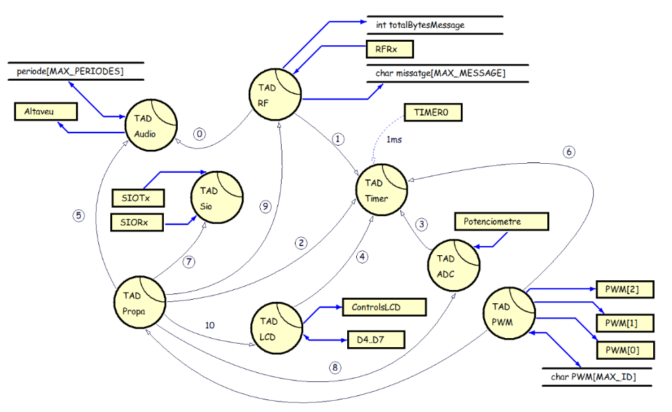
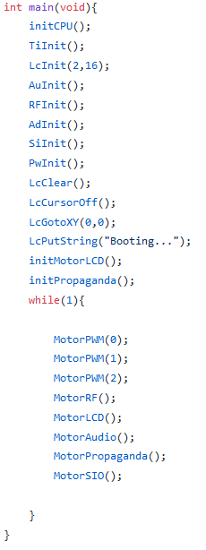
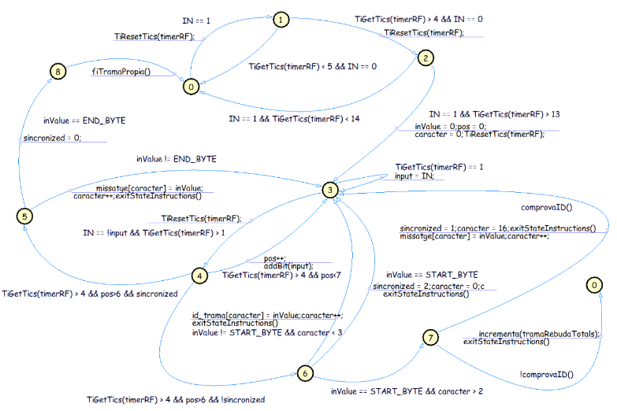
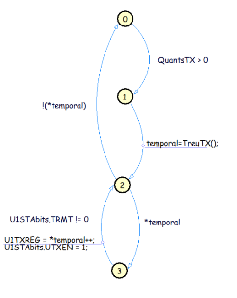

# Cooperative Programming

Cooperative Programing is a way of structuring the code so for instance a microcontroller with only one execution thread can execute tasks as if they were executed simultaneously.

The main idea is to structure the project in what is called [Abstract data type (ADT)](https://en.wikipedia.org/wiki/Abstract_data_type). That are basically modules that contain data and functions to manipulate these, with the condition that this data will only be accessible through these functions. 

We separate ADTs in two ways:
* Simple ADTs, they don’t do any logic through time, so they objective is just to provide an interface to use some I/O for example. 
* Logic ADTs, these ones have tasks that need to be executed constantly so we create what we call Motors. They are basically small state machines that execute tasks every time the condition to go to the next state is met.

## ADTs diagram

This is the actual representation of a ADT diagram. Where the different modules connect to a specific peripheral (Boxes) and its most important variables (Semi-closed boxes). The arrows connecting each variable/peripheral represent the direction of the data flow.

Each connection to the other ADTs have a number specifying the interface together with the direction of the access. All the interfaces are explained in what we call the Dictionary, where each function used by the direction of the arrow, has its PRE and POST conditions.

[Dictionary of the ADT diagram](Dictionary.c)

On the other hand, arrows like one in the Timer, defines an interruption together with the time it occurs.  

The idea of execution is that there's the main loop, where is constantly calling all the motors available so each one can execute a small task, this produces the effect of acting as they are performing tasks simultaneously.

### Main Loop

On the [full report](Report.pdf) it is available all the motors of each logic ADT (In Catalan though). But as an example, here is the most important and complex motor of this project (from the RF ADT).

### RF Motor

### UART Motor
At the same time, they can be simple, like the SIO (UART).

