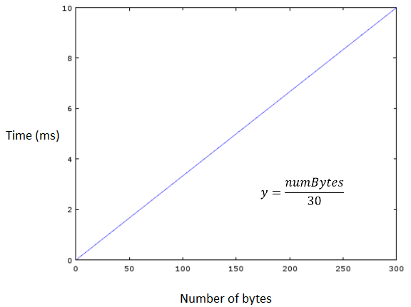

# Phase Two - The receiver

This phase consists of creating the receiver of our custom RF protocol using the [Manchester Code](https://en.wikipedia.org/wiki/Manchester_code) with a 100bps transmission rate.

It is separated in the following modules.

## LCD

The user will have a LCD to read the last message received, the actual receiver ID and the number of frames received.

As you can see in the previous image, it displays:
1. The ID of the receiver. Without any configuration set, this ID will constantly be rotating cyclically (0-9) until an ID is set through the HyperTerminal. 
2. Number of frames received that were targeted to us.
3. Total number of frames received.
4. It will have several states:
    1. "Waiting for ID" when there's no ID set.
    2. "ID set"
    3. "New Message" when the receiver receives a message targeted to him.
    4. Message in the received frame

An example of how the message will appear:

## [ADC](https://en.wikipedia.org/wiki/Analog-to-digital_converter)

The board has a potentiometer that will serve as an analog input to the system. It will be used to regulate the speed of the LCD. The minimum value will be 200ms to 2s per letter. A graph of the following equation shown below.

## Speaker

The speaker sounds every time the board receives a message associated to his identifier. The melody is proportional to the length of the message.

## [UART](https://en.wikipedia.org/wiki/Universal_asynchronous_receiver-transmitter)

Using the UART and the RS-232 protocol, the board communicates with the computer, from where you can either configure the identifier of the board or know some statistics of the receiver. The menu shown in the HyperTerminal is the following:

1. Set a new Identifier
2. See actual ID
3. See number identified frames received
3. See number of the total frames received
5. See the last received message

## [PWM](https://en.wikipedia.org/wiki/Pulse-width_modulation)

Three ports will be used as PWM indicating the identifier set of the board. With a 50hz frequency and a variable Duty Cycle ranging from 2-20ms (As happened in the LCD, when the identifier is not set, it will keep rotating the value from 0-9).
The following image show how the PWMs will work.

## Board

Finally, here is a picture of how the board looks like.

