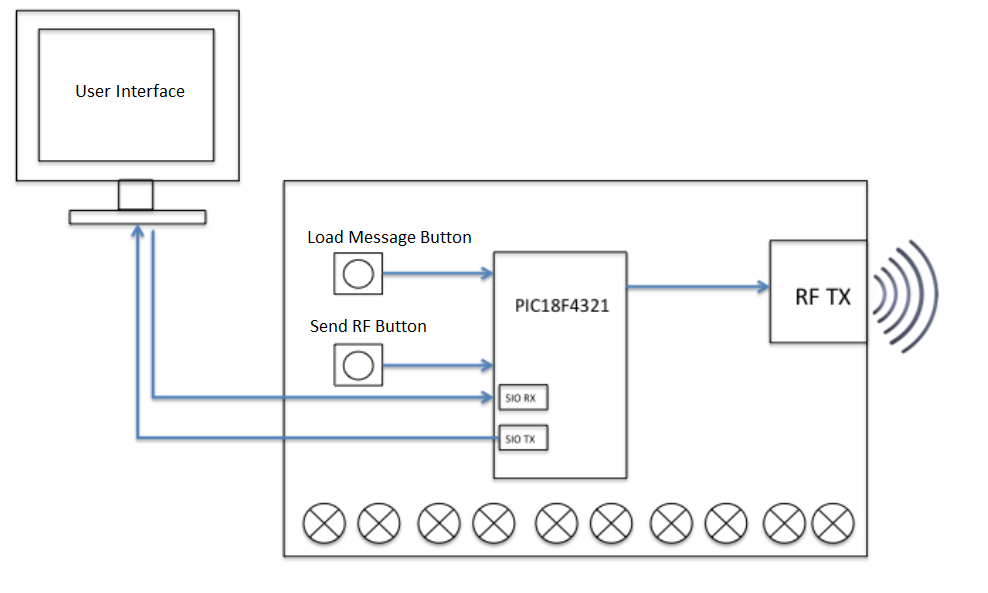
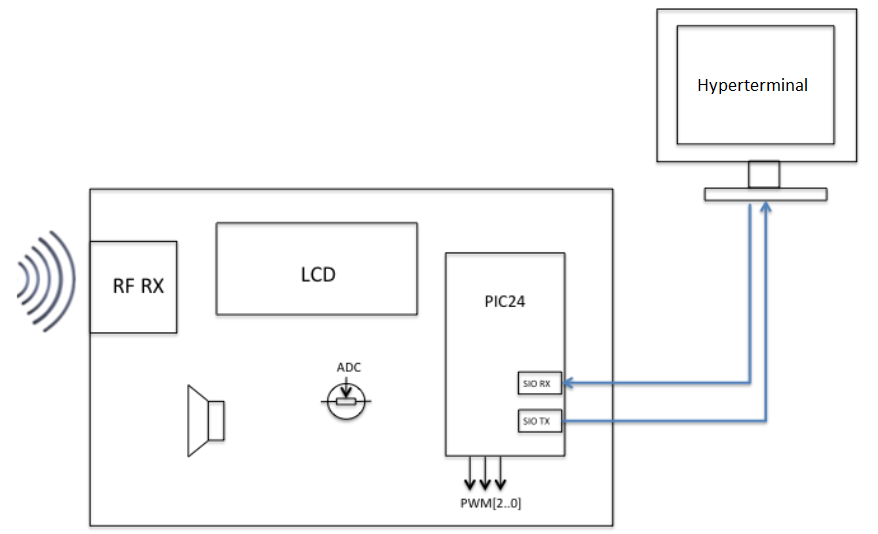

# RFtext

The proposed challenge of this project is the creation of a telecommunications network based on radio frequency links 
controlled by microcontrollers. The main idea is to have a central emitter that will communicate with receivers sending text messages wirelessly.

Therefore, the system consists of two well differentiated blocks that will respectively correspond to each of the two phases of
the project: the transmitter and receiver.

## [Phase One - Transmitter](PhaseOne/)
 
The first phase, consists of a PIC18F4321 microcontroller programmed in the assembler. This system is capable of (1) communicating with a computer through RS-232 serial communication protocol, (2) receiving a text message from the computer and (3) forwarding the message by radio frequency. The following figure shows a general diagram of Phase 1. Regarding the user interface, to allow the user to communicate with the transmitter, a Java interface is provided.

## [Phase Two - Receiver](PhaseTwo/)

The second phase of this project, has the ability receiving and displaying messages that have been sent from the transmitter. It is programmed exclusively in C using the cooperative programming/multitasking approach. In this case, the user interface consists of the LCD display and the HyperTerminal in the computer connected through RS-232 serial communication protocol.

The general diagram showing the different modules is shown in the image below.

